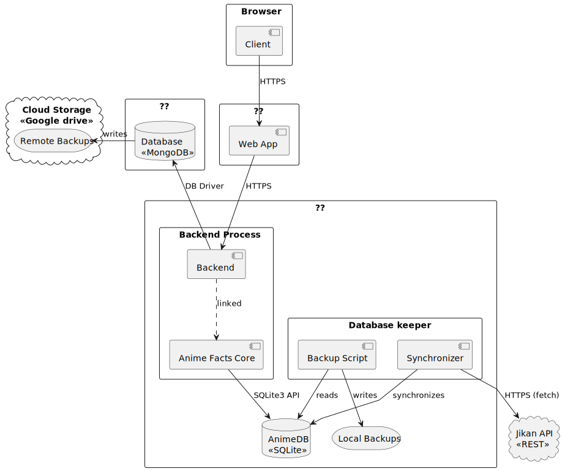

# Administração de sistemas e deployment
Este repositório consiste em scripts, _tools_ de manutenção, documentação global sobre o quesito físico, monitorização de processos e eventuais automatizações.



## Como formar a base de dados de animes
A base de dados consiste inteiramente de informação open source. Para criar a base de dados existem alguns scripts python e um _Makefile_ na pasta `/scripts`. A informação da base de dados é proveniente do site [MyAnimeList](https://myanimelist.net/), extraída pelo _API_ não oficial [Jikan](https://jikan.moe/).

A formação da base de dados consiste de dois passos:
1. A extração da informação.
2. O _bootstrapping_ e inserção da informação num ficheiro SQLite.

No ficheiro `/scripts/Makefile` podem ser mudadas as constantes de nomes de ficheiros caso tal seja desejado. O target `make all` irá automaticamente executar os scripts de scraping de animes, de relações, e o de formação da base de dados; resultando numa base de dados formada no caminho indicado. Esta base de dados está agora pronta para ser usada pelo [API](https://github.com/afuradanime/anime-facts-core).

> [!WARNING]  
> O processo de importar animes pode demorar mais de 20 minutos.
> O processo de importar relações pode demorar várias horas!

Dada a natureza destes processos é recomendado serem executas individualmente e os seus outputs verificados. Os scripts estão documentados e os seus parametros podem ser consultados com `[script].py --help`:
```sh
> python .\scraper.py --help
usage: scraper.py [-h] [--output OUTPUT] [--scrape-target SCRAPE_TARGET] [--anime-data ANIME_DATA]

Scrape MAL data from jikan

optional arguments:
  -h, --help            show this help message and exit
  --output OUTPUT       Path to output json file (default: anime_data_all.jsonl)
  --scrape-target SCRAPE_TARGET
                        Type of data to scrape (anime | relations)
  --anime-data ANIME_DATA
                        Path to anime data file you got from running 'python scraper.py --scrape-target anime' (required if scraping relations)
```

Alternativamente os _targets_ do _Makefile_ abstraem o processo de passar os parametros manualmente.

## Targets
1. **all**: scrape + build_database
2. **backup**: Cria um backup do ficheiro \$(TARGET_DB) na pasta `scripts\_backups`, elimina o backup nº \$(BACKUP_COUNT)
3. **restore**: Substitui o ficheiro \$(TARGET_DB) actual com o backup mais recente, apaga o backup mais recente da pasta `scripts\_backups`
4. **scrape**: scrape + scrape_anime
5. **scrape_anime**: Faz scrape de todos os animes que encontrar e persiste tudo no ficheiro \$(TARGET_JSON)
6. **scrape_relations**: Faz scrape de todas as relações de animes que encontrar e persiste tudo no ficheiro \$(RELATION_JSON)
7. **build_database**: Depende dos ficheiros \$(TARGET_JSON) e \$(RELATION_JSON)[^1] e cria uma base de dados sqlite no ficheiro \$(TARGET_DB) [^2]


[^1] É possível executar sem o json das relações, estas só nãos erão preenchidas
[^2] Este target faz um backup antes de reescrever a base de dados, ele também renomeia a base de dados actual (se existir) para \$(TARGET_DB).old e se já houver um \$(TARGET_DB).old ele será apagado.